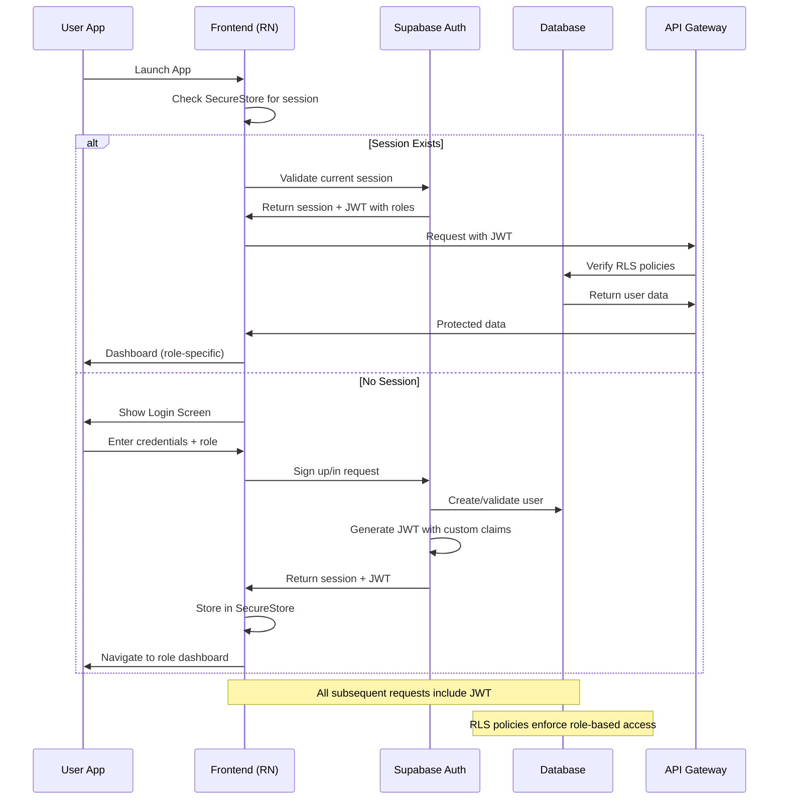

# Salon Management System - Authentication Architecture Guide

## 🏗️ System Architecture Overview

This document outlines the complete authentication architecture for the Salon Management System, including backend design, frontend implementation, and testing strategies for a secure, multi-role system.

---

## 📊 Architecture Decision Matrix

| Aspect | Strategy | Rationale | Safety | Speed |
|--------|----------|-----------|--------|-------|
| **Auth Provider** | Supabase Auth + Custom Claims | Proven at scale, handles JWT automatically | ⭐⭐⭐⭐⭐ | ⭐⭐⭐⭐⭐ |
| **Token Storage** | SecureStore (iOS) / EncryptedSharedPreferences (Android) | Hardware-backed secure storage | ⭐⭐⭐⭐⭐ | ⭐⭐⭐⭐ |
| **Role Management** | Database-driven with RLS | Centralized, audit-friendly | ⭐⭐⭐⭐⭐ | ⭐⭐⭐ |
| **API Design** | REST with JWT middleware | Simple, testable, universal | ⭐⭐⭐⭐ | ⭐⭐⭐⭐⭐ |
| **Session Management** | Short access token (15min) + rotating refresh (7d) | Minimizes token theft impact | ⭐⭐⭐⭐⭐ | ⭐⭐⭐⭐ |

---

## 🔐 Authentication Flow Diagram



---

## 🎯 5-Role Authentication System

### Role Hierarchy

```
SUPER_ADMIN (System Level)
    └── OWNER (Business Level)
        ├── MANAGER (Operational Level)
        ├── STAFF (Service Level)
        ├── VENDOR (Supply Level)
        └── CUSTOMER (End User)
```

### Role Capabilities Matrix

| Feature | Super Admin | Owner | Manager | Staff | Vendor | Customer |
|---------|-------------|-------|---------|-------|--------|----------|
| System Config | ✅ | ❌ | ❌ | ❌ | ❌ | ❌ |
| Multi-Salon View | ✅ | ✅ | ✅ | ❌ | ❌ | ❌ |
| Staff Management | ✅ | ✅ | ✅ | ❌ | ❌ | ❌ |
| Financial Reports | ✅ | ✅ | ✅ | ❌ | ❌ | ❌ |
| Inventory Mgmt | ✅ | ✅ | ✅ | ❌ | ✅ | ❌ |
| Service Delivery | ❌ | ❌ | ❌ | ✅ | ❌ | ❌ |
| Booking Management | ✅ | ✅ | ✅ | ✅ | ❌ | ✅ |
| Profile Management | ✅ | ✅ | ✅ | ✅ | ✅ | ✅ |

---

## 🗄️ Database Schema Design

### Core Tables

```sql
-- Custom types for roles and permissions
CREATE TYPE public.user_role AS ENUM (
    'SUPER_ADMIN',
    'OWNER', 
    'MANAGER',
    'STAFF',
    'VENDOR',
    'CUSTOMER'
);

CREATE TYPE public.permission AS ENUM (
    'system.config',
    'salon.create',
    'salon.manage',
    'staff.manage',
    'staff.view',
    'inventory.manage',
    'booking.create',
    'booking.manage',
    'reports.view',
    'profile.edit'
);

-- User roles table
CREATE TABLE public.user_roles (
    id UUID PRIMARY KEY DEFAULT gen_random_uuid(),
    user_id UUID REFERENCES auth.users(id) ON DELETE CASCADE,
    role user_role NOT NULL,
    salon_id UUID REFERENCES salons(id) ON DELETE CASCADE,
    created_at TIMESTAMPTZ DEFAULT now(),
    updated_at TIMESTAMPTZ DEFAULT now(),
    UNIQUE(user_id, salon_id)
);

-- Role permissions mapping
CREATE TABLE public.role_permissions (
    id UUID PRIMARY KEY DEFAULT gen_random_uuid(),
    role user_role NOT NULL,
    permission permission NOT NULL,
    created_at TIMESTAMPTZ DEFAULT now(),
    UNIQUE(role, permission)
);

-- Salon information
CREATE TABLE public.salons (
    id UUID PRIMARY KEY DEFAULT gen_random_uuid(),
    name TEXT NOT NULL,
    owner_id UUID REFERENCES auth.users(id),
    settings JSONB DEFAULT '{}',
    created_at TIMESTAMPTZ DEFAULT now(),
    updated_at TIMESTAMPTZ DEFAULT now()
);

-- Insert default permissions
INSERT INTO public.role_permissions (role, permission) VALUES
    -- Super Admin permissions
    ('SUPER_ADMIN', 'system.config'),
    ('SUPER_ADMIN', 'salon.create'),
    ('SUPER_ADMIN', 'staff.manage'),
    ('SUPER_ADMIN', 'inventory.manage'),
    ('SUPER_ADMIN', 'reports.view'),
    
    -- Owner permissions
    ('OWNER', 'salon.manage'),
    ('OWNER', 'staff.manage'),
    ('OWNER', 'inventory.manage'),
    ('OWNER', 'reports.view'),
    
    -- Manager permissions
    ('MANAGER', 'staff.view'),
    ('MANAGER', 'booking.manage'),
    ('MANAGER', 'reports.view'),
    
    -- Staff permissions
    ('STAFF', 'booking.create'),
    ('STAFF', 'profile.edit'),
    
    -- Vendor permissions
    ('VENDOR', 'inventory.manage'),
    ('VENDOR', 'profile.edit'),
    
    -- Customer permissions
    ('CUSTOMER', 'booking.create'),
    ('CUSTOMER', 'profile.edit');
```

### Row Level Security (RLS) Policies

```sql
-- Enable RLS on all tables
ALTER TABLE public.user_roles ENABLE ROW LEVEL SECURITY;
ALTER TABLE public.salons ENABLE ROW LEVEL SECURITY;

-- Custom JWT claims function
CREATE OR REPLACE FUNCTION public.get_user_role()
RETURNS public.user_role
LANGUAGE sql
SECURITY DEFINER
SET search_path = public
AS $$
  SELECT (auth.jwt() ->> 'user_role')::public.user_role;
$$;

-- RLS Policies
CREATE POLICY "Users can view their own role" ON public.user_roles
    FOR SELECT USING (auth.uid() = user_id);

CREATE POLICY "Owners can view salon staff" ON public.user_roles
    FOR SELECT USING (
        get_user_role() IN ('OWNER', 'MANAGER') 
        AND salon_id IN (
            SELECT id FROM public.salons 
            WHERE owner_id = auth.uid() OR 
            id IN (SELECT salon_id FROM public.user_roles 
                  WHERE user_id = auth.uid() AND role = 'MANAGER')
        )
    );

CREATE POLICY "Salons visible to authorized users" ON public.salons
    FOR SELECT USING (
        owner_id = auth.uid() OR
        id IN (SELECT salon_id FROM public.user_roles WHERE user_id = auth.uid())
    );
```

### Custom Access Token Hook

```sql
CREATE OR REPLACE FUNCTION public.custom_access_token_hook(event jsonb)
RETURNS jsonb
LANGUAGE plpgsql
SECURITY DEFINER
SET search_path = public
AS $$
DECLARE
    claims jsonb := event -> 'claims';
    user_role public.user_role;
    salon_id uuid;
BEGIN
    -- Get user's primary role and salon
    SELECT role, salon_id 
    INTO user_role, salon_id
    FROM public.user_roles 
    WHERE user_id = (event ->> 'user_id')::uuid
    ORDER BY created_at DESC
    LIMIT 1;
    
    -- Add custom claims
    claims := jsonb_set(
        claims, 
        '{user_role}', 
        COALESCE(to_jsonb(user_role), 'null')
    );
    
    claims := jsonb_set(
        claims,
        '{salon_id}',
        COALESCE(to_jsonb(salon_id), 'null')
    );
    
    -- Update event with new claims
    event := jsonb_set(event, '{claims}', claims);
    RETURN event;
END;
$$;

-- Register the hook
UPDATE supabase.auth.config
SET custom_access_token_hook = 'public.custom_access_token_hook';
```

---

## 📱 Frontend Architecture

### Directory Structure

```
src/
├── app/
│   ├── navigation/
│   │   ├── AppNavigator.tsx          # Root navigator with role routing
│   │   ├── AuthNavigator.tsx         # Authentication screens
│   │   ├── OwnerNavigator.tsx        # Owner-specific screens
│   │   ├── StaffNavigator.tsx        # Staff-specific screens
│   │   ├── VendorNavigator.tsx       # Vendor-specific screens
│   │   └── CustomerNavigator.tsx     # Customer-specific screens
│   ├── screens/
│   │   ├── auth/
│   │   │   ├── LoginScreen.tsx
│   │   │   ├── RegisterScreen.tsx
│   │   │   └── RoleSelectScreen.tsx
│   │   └── [role]/                   # Role-specific screens
│   ├── providers/
│   │   ├── AuthProvider.tsx          # Authentication context
│   │   ├── RoleProvider.tsx          # Role-based permissions
│   │   └── ApiProvider.tsx           # API client setup
│   └── components/
│       └── common/
│           └── ProtectedScreen.tsx   # HOC for protected routes
├── services/
│   ├── auth.service.ts               # Authentication functions
│   ├── api.service.ts                # API client with interceptors
│   └── storage.service.ts            # Secure storage utilities
└── types/
    ├── auth.types.ts                 # Authentication types
    └── api.types.ts                  # API response types
```

### Authentication Provider Implementation

```typescript
// src/providers/AuthProvider.tsx
import React, { createContext, useContext, useEffect, useState } from 'react';
import { Session, User } from '@supabase/supabase-js';
import { supabase } from '../services/supabase';
import * as SecureStore from 'expo-secure-store';
import { UserRole } from '../types/auth.types';

interface AuthContextType {
  user: User | null;
  session: Session | null;
  role: UserRole | null;
  loading: boolean;
  login: (email: string, password: string, role: UserRole) => Promise<void>;
  register: (email: string, password: string, role: UserRole) => Promise<void>;
  logout: () => Promise<void>;
  hasPermission: (permission: string) => boolean;
}

const AuthContext = createContext<AuthContextType>({
  user: null,
  session: null,
  role: null,
  loading: false,
  login: async () => {},
  register: async () => {},
  logout: async () => {},
  hasPermission: () => false,
});

export const useAuth = () => useContext(AuthContext);

export const AuthProvider: React.FC<{ children: React.ReactNode }> = ({ children }) => {
  const [user, setUser] = useState<User | null>(null);
  const [session, setSession] = useState<Session | null>(null);
  const [role, setRole] = useState<UserRole | null>(null);
  const [loading, setLoading] = useState(true);

  // Load session on mount
  useEffect(() => {
    loadSession();
    
    // Listen for auth changes
    const { data: authListener } = supabase.auth.onAuthStateChange(
      async (event, session) => {
        if (session) {
          setUser(session.user);
          setSession(session);
          
          // Extract role from JWT
          const jwt = session.access_token;
          const payload = JSON.parse(atob(jwt.split('.')[1]));
          setRole(payload.user_role);
          
          await SecureStore.setItemAsync('session', JSON.stringify(session));
        } else {
          setUser(null);
          setSession(null);
          setRole(null);
          await SecureStore.deleteItemAsync('session');
        }
        setLoading(false);
      }
    );

    return () => authListener.subscription.unsubscribe();
  }, []);

  const loadSession = async () => {
    try {
      const sessionData = await SecureStore.getItemAsync('session');
      if (sessionData) {
        const session = JSON.parse(sessionData);
        setSession(session);
        setUser(session.user);
        
        // Validate session with Supabase
        const { data: { session: currentSession } } = await supabase.auth.setSession(
          session.access_token,
          session.refresh_token
        );
        
        if (currentSession) {
          const payload = JSON.parse(atob(currentSession.access_token.split('.')[1]));
          setRole(payload.user_role);
        }
      }
    } catch (error) {
      console.error('Error loading session:', error);
    } finally {
      setLoading(false);
    }
  };

  const login = async (email: string, password: string, selectedRole: UserRole) => {
    setLoading(true);
    try {
      const { data, error } = await supabase.auth.signInWithPassword({
        email,
        password,
      });

      if (error) throw error;

      // Update role if different from stored
      const payload = JSON.parse(atob(data.session?.access_token!.split('.')[1]));
      if (payload.user_role !== selectedRole) {
        await supabase.from('user_roles').update({ 
          role: selectedRole,
          updated_at: new Date().toISOString()
        }).eq('user_id', data.user!.id);
      }

    } catch (error) {
      console.error('Login error:', error);
      throw error;
    } finally {
      setLoading(false);
    }
  };

  const register = async (email: string, password: string, role: UserRole) => {
    setLoading(true);
    try {
      const { data, error } = await supabase.auth.signUp({
        email,
        password,
        options: {
          data: {
            user_role: role,
          },
        },
      });

      if (error) throw error;

      // Create user role entry
      if (data.user) {
        await supabase.from('user_roles').insert({
          user_id: data.user.id,
          role: role,
          // salon_id to be set later for non-customer roles
        });
      }

    } catch (error) {
      console.error('Registration error:', error);
      throw error;
    } finally {
      setLoading(false);
    }
  };

  const logout = async () => {
    await supabase.auth.signOut();
  };

  const hasPermission = (permission: string): boolean => {
    // This would check against role permissions
    // For now, implement basic role checks
    switch (role) {
      case 'SUPER_ADMIN':
        return true;
      case 'OWNER':
        return !['system.config'].includes(permission);
      case 'MANAGER':
        return ['staff.view', 'booking.manage', 'reports.view', 'profile.edit'].includes(permission);
      case 'STAFF':
        return ['booking.create', 'profile.edit'].includes(permission);
      case 'VENDOR':
        return ['inventory.manage', 'profile.edit'].includes(permission);
      case 'CUSTOMER':
        return ['booking.create', 'profile.edit'].includes(permission);
      default:
        return false;
    }
  };

  return (
    <AuthContext.Provider
      value={{
        user,
        session,
        role,
        loading,
        login,
        register,
        logout,
        hasPermission,
      }}
    >
      {children}
    </AuthContext.Provider>
  );
};
```

### Role-Based Navigation

```typescript
// src/app/navigation/AppNavigator.tsx
import React from 'react';
import { createNativeStackNavigator } from '@react-navigation/native-stack';
import { useAuth } from '../../providers/AuthProvider';
import { AuthNavigator } from './AuthNavigator';
import { OwnerNavigator } from './OwnerNavigator';
import { StaffNavigator } from './StaffNavigator';
import { VendorNavigator } from './VendorNavigator';
import { CustomerNavigator } from './CustomerNavigator';
import { SuperAdminNavigator } from './SuperAdminNavigator';
import { SplashScreen } from '../screens/SplashScreen';

const Stack = createNativeStackNavigator();

export const AppNavigator = () => {
  const { user, loading, role } = useAuth();

  if (loading) {
    return <SplashScreen />;
  }

  if (!user) {
    return <AuthNavigator />;
  }

  const getRoleNavigator = () => {
    switch (role) {
      case 'SUPER_ADMIN':
        return <SuperAdminNavigator />;
      case 'OWNER':
        return <OwnerNavigator />;
      case 'MANAGER':
        return <OwnerNavigator />; // Manager uses owner nav with limited access
      case 'STAFF':
        return <StaffNavigator />;
      case 'VENDOR':
        return <VendorNavigator />;
      case 'CUSTOMER':
        return <CustomerNavigator />;
      default:
        return <AuthNavigator />;
    }
  };

  return getRoleNavigator();
};
```

### Protected Screen Component

```typescript
// src/components/common/ProtectedScreen.tsx
import React from 'react';
import { View, Text } from 'react-native';
import { useAuth } from '../../providers/AuthProvider';

interface ProtectedScreenProps {
  children: React.ReactNode;
  requiredPermission?: string;
  fallback?: React.ReactNode;
}

export const ProtectedScreen: React.FC<ProtectedScreenProps> = ({
  children,
  requiredPermission,
  fallback = (
    <View style={{ flex: 1, justifyContent: 'center', alignItems: 'center' }}>
      <Text>Access Denied</Text>
    </View>
  ),
}) => {
  const { hasPermission } = useAuth();

  if (requiredPermission && !hasPermission(requiredPermission)) {
    return fallback;
  }

  return <>{children}</>;
};
```

---

## 🔌 API Architecture

### Service Layer Implementation

```typescript
// src/services/api.service.ts
import { supabase } from './supabase';
import { Session } from '@supabase/supabase-js';

class ApiService {
  private session: Session | null = null;

  setSession(session: Session | null) {
    this.session = session;
  }

  private async request<T>(
    endpoint: string,
    options: RequestInit = {}
  ): Promise<T> {
    const url = `${process.env.EXPO_PUBLIC_API_URL}${endpoint}`;
    
    const headers = {
      'Content-Type': 'application/json',
      ...options.headers,
    };

    if (this.session?.access_token) {
      headers['Authorization'] = `Bearer ${this.session.access_token}`;
    }

    const response = await fetch(url, {
      ...options,
      headers,
    });

    if (!response.ok) {
      throw new Error(`API Error: ${response.status}`);
    }

    return response.json();
  }

  // Role-specific endpoints
  async getOwnerDashboard() {
    return this.request('/api/owner/dashboard');
  }

  async getStaffSchedule() {
    return this.request('/api/staff/schedule');
  }

  async getVendorInventory() {
    return this.request('/api/vendor/inventory');
  }

  async getCustomerBookings() {
    return this.request('/api/customer/bookings');
  }

  // Generic CRUD operations
  async get<T>(endpoint: string): Promise<T> {
    return this.request<T>(endpoint);
  }

  async post<T>(endpoint: string, data: any): Promise<T> {
    return this.request<T>(endpoint, {
      method: 'POST',
      body: JSON.stringify(data),
    });
  }

  async put<T>(endpoint: string, data: any): Promise<T> {
    return this.request<T>(endpoint, {
      method: 'PUT',
      body: JSON.stringify(data),
    });
  }

  async delete<T>(endpoint: string): Promise<T> {
    return this.request<T>(endpoint, {
      method: 'DELETE',
    });
  }
}

export const apiService = new ApiService();
```

---

## 🧪 Testing Strategy

### Authentication Flow Tests

```typescript
// __tests__/auth/AuthProvider.test.tsx
import React from 'react';
import { renderHook, act } from '@testing-library/react-native';
import { AuthProvider, useAuth } from '../../src/providers/AuthProvider';
import { supabase } from '../../src/services/supabase';

// Mock Supabase
jest.mock('../../src/services/supabase', () => ({
  supabase: {
    auth: {
      signInWithPassword: jest.fn(),
      signUp: jest.fn(),
      signOut: jest.fn(),
      onAuthStateChange: jest.fn(() => ({
        data: { subscription: { unsubscribe: jest.fn() } },
      })),
    },
  },
}));

// Mock SecureStore
jest.mock('expo-secure-store', () => ({
  getItemAsync: jest.fn(),
  setItemAsync: jest.fn(),
  deleteItemAsync: jest.fn(),
}));

describe('AuthProvider', () => {
  it('should login successfully', async () => {
    const mockUser = { id: '123', email: 'test@example.com' };
    const mockSession = {
      user: mockUser,
      access_token: 'mock.token',
      refresh_token: 'mock.refresh',
    };

    (supabase.auth.signInWithPassword as jest.Mock).mockResolvedValue({
      data: { session: mockSession },
      error: null,
    });

    const wrapper = ({ children }: { children: React.ReactNode }) => (
      <AuthProvider>{children}</AuthProvider>
    );

    const { result } = renderHook(() => useAuth(), { wrapper });

    await act(async () => {
      await result.current.login('test@example.com', 'password', 'OWNER');
    });

    expect(result.current.user).toEqual(mockUser);
    expect(result.current.role).toBe('OWNER');
  });

  it('should handle login failure', async () => {
    const mockError = new Error('Invalid credentials');
    (supabase.auth.signInWithPassword as jest.Mock).mockResolvedValue({
      data: null,
      error: mockError,
    });

    const wrapper = ({ children }: { children: React.ReactNode }) => (
      <AuthProvider>{children}</AuthProvider>
    );

    const { result } = renderHook(() => useAuth(), { wrapper });

    await expect(
      act(async () => {
        await result.current.login('test@example.com', 'wrong', 'OWNER');
      })
    ).rejects.toThrow('Invalid credentials');
  });
});
```

### E2E Test Scenarios

```typescript
// e2e/auth-flow.e2e.ts
import { device, element, by, expect } from 'detox';

describe('Authentication Flow', () => {
  beforeEach(async () => {
    await device.reloadReactNative();
  });

  it('should complete login flow for owner', async () => {
    // Navigate to login
    await element(by.id('login-button')).tap();
    
    // Enter credentials
    await element(by.id('email-input')).typeText('owner@salon.com');
    await element(by.id('password-input')).typeText('password123');
    
    // Select role
    await element(by.id('role-selector')).tap();
    await element(by.text('Owner')).tap();
    
    // Submit
    await element(by.id('submit-login')).tap();
    
    // Verify dashboard
    await expect(element(by.id('owner-dashboard'))).toBeVisible();
    await expect(element(by.id('revenue-chart'))).toBeVisible();
  });

  it('should show role-specific features', async () => {
    // Login as staff
    await loginAsStaff();
    
    // Verify staff-specific features
    await expect(element(by.id('my-schedule'))).toBeVisible();
    await expect(element(by.id('today-appointments'))).toBeVisible();
    
    // Verify owner features are not present
    await expect(element(by.id('financial-reports'))).not.toBeVisible();
  });
});

const loginAsStaff = async () => {
  await element(by.id('login-button')).tap();
  await element(by.id('email-input')).typeText('staff@salon.com');
  await element(by.id('password-input')).typeText('password123');
  await element(by.id('role-selector')).tap();
  await element(by.text('Staff')).tap();
  await element(by.id('submit-login')).tap();
};
```

---

## 🚀 Implementation Checklist

### Backend Setup
- [ ] Configure Supabase project
- [ ] Create database schema (tables, types, policies)
- [ ] Set up custom access token hook
- [ ] Configure RLS policies for all tables
- [ ] Create role permissions matrix
- [ ] Set up API Gateway (if needed)

### Frontend Setup
- [ ] Install required dependencies
- [ ] Set up navigation structure
- [ ] Implement AuthProvider
- [ ] Create role-specific navigators
- [ ] Build login/register screens
- [ ] Implement ProtectedScreen component

### Security Implementation
- [ ] Configure SecureStore for token storage
- [ ] Implement token refresh logic
- [ ] Add permission checking in components
- [ ] Set up API interceptors for auth
- [ ] Configure secure headers

### Testing
- [ ] Unit tests for auth functions
- [ ] Integration tests for API calls
- [ ] E2E tests for complete flows
- [ ] Security testing for RLS policies
- [ ] Performance testing for token validation

---

## 📊 Performance Considerations

### Token Management
- Use short-lived access tokens (15 minutes)
- Implement silent token refresh
- Cache role permissions locally
- Minimize JWT payload size

### Database Optimization
- Index frequently queried columns (user_id, role, salon_id)
- Use materialized views for complex permission checks
- Implement connection pooling
- Cache role permissions in Redis

### Frontend Optimization
- Lazy load role-specific screens
- Pre-fetch user permissions
- Implement offline mode for basic functions
- Use React.memo for permission checks

---

## 🔒 Security Best Practices

### Data Protection
- Always validate permissions on the backend
- Use RLS as the primary security layer
- Implement audit logging for sensitive actions
- Encrypt sensitive data at rest

### Token Security
- Store tokens in secure storage only
- Implement token rotation
- Handle token expiration gracefully
- Clear tokens on logout

### API Security
- Validate JWT on every request
- Implement rate limiting
- Use HTTPS everywhere
- Sanitize all inputs

---

## 🎯 Deployment Strategy

### Development Environment
1. Supabase local development
2. Mock API responses for testing
3. Debug mode for detailed logging
4. Test users for each role

### Staging Environment
1. Supabase staging project
2. Real API endpoints
3. Test data with all roles
4. Performance monitoring

### Production Environment
1. Supabase production project
2. Optimized builds
3. Error monitoring
4. Analytics tracking

---

This architecture provides a secure, scalable foundation for the Salon Management System with comprehensive role-based authentication, ensuring that each user type has the appropriate access level while maintaining security and performance standards.